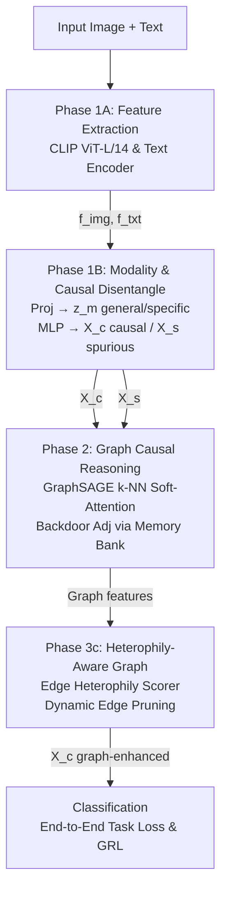

# Kiến Trúc Tối Ưu Cho Hệ Thống Dự Đoán Thảm Họa Đa Phương Thức — CausalCrisis v2

## Tổng Quan
Báo cáo này tổng hợp toàn bộ nghiên cứu chuyên sâu nhằm thiết kế kiến trúc tốt nhất có thể cho bài toán phân loại thảm họa đa phương thức (multimodal crisis classification) với khả năng domain generalization đến các loại thảm họa chưa từng thấy. Kiến trúc đề xuất — **CausalCrisis v2** — được xây dựng bằng cách tổng hợp ưu điểm từ 7 phương pháp SOTA đã công bố, vượt qua giới hạn của từng phương pháp riêng lẻ thông qua ba tầng disentanglement (tách biệt đặc trưng): modality-level, domain-level và feature sufficiency.

Benchmark hiện tại trên CrisisMMD LODO (Leave-One-Domain-Out): CAMO đạt trung bình 0.903 accuracy (informative task). Mục tiêu của CausalCrisis v2 là vượt qua con số này thông qua kiến trúc graph-enhanced causal reasoning — đóng góp novel mà không framework nào hiện có sở hữu.

---

## Phân Tích Toàn Cảnh Các Phương Pháp SOTA

### Landscape Hai Paradigm Đánh Giá
Các phương pháp trên CrisisMMD chia thành hai nhóm đánh giá fundamentally khác nhau, và sự nhầm lẫn giữa hai nhóm này là nguyên nhân chính gây hiểu sai về hiệu quả thực sự của model:

| Paradigm | Phương pháp tiêu biểu | Best F1/Acc | Đặc điểm |
| :--- | :--- | :--- | :--- |
| **In-domain (Setting A/B)** | CrisisSpot, CrisisKAN, DiffAttn | F1=98.23% (Task1) | Train/test cùng distribution |
| **Domain Generalization (LODO)** | CAMO, SimMMDG, CMRF | Acc=90.3% (informative) | Train trên 3 disaster types, test trên 1 type chưa thấy |

*CrisisSpot* đạt F1=98.23% trên informative task nhưng sử dụng Social Context Features (user credibility, engagement metrics) — những đặc trưng không khả dụng trong DG setting khi crisis type mới xảy ra. *CAMO* tuy "chỉ" đạt 90.3%, nhưng trên unseen domain — đây mới là thước đo thực tế cho hệ thống ứng phó thảm họa.

### So Sánh Chi Tiết 6 Framework Chính

| Khía cạnh | CAMO | SimMMDG | CMRF | CIRL | CAL/CAL+ | CrisisSpot |
| :--- | :--- | :--- | :--- | :--- | :--- | :--- |
| **Encoder** | CLIP | Task-specific | CLIP | ResNet | GNN | BERT+ResNet50 |
| **Modality split** | ✅ $z_m / \hat{z}_m$ | ✅ shared/specific | ❌ | ❌ (single-modal) | ❌ (graph only) | ❌ |
| **Causal disentangle** | ✅ $X_c / X_s$ via MLP | ❌ | ❌ | ✅ Fourier aug | ✅ Attention-based | ❌ |
| **GRL adversarial** | ✅ | ❌ | ❌ | ❌ | ❌ | ❌ |
| **SupCon** | ✅ | ✅ | ❌ | ❌ | ❌ | ❌ |
| **Graph** | ❌ | ❌ | ❌ | ❌ | ✅ + Memory bank | ✅ GraphSAGE |
| **Mixup** | ✅ | ❌ | ❌ | ❌ | ❌ | ❌ |
| **Backdoor adjustment** | ❌ | ❌ | ❌ | ❌ | ✅ $P(Y\|do(X_c))$ | ❌ |
| **Causal sufficiency** | ❌ | ❌ | ❌ | ✅ Adv. Mask | ❌ | ❌ |
| **Evaluation** | LODO | LODO | LODO | Leave-one-out | OOD graph cls | In-domain |
| **CrisisMMD Acc** | 90.3% avg | 86.9% avg | 89.1% avg | N/A | N/A | 97.58% (in-domain) |

**Quan sát then chốt:** Không framework nào kết hợp đủ cả 3 tầng — modality disentanglement, causal disentanglement, VÀ graph-based reasoning. Đây chính là khoảng trống mà CausalCrisis v2 sẽ lấp đầy.

---

## Nền Tảng Lý Thuyết

### Structural Causal Model Cho Crisis Classification
CAMO xây dựng SCM gốc cho bài toán crisis classification:

$$X_s \leftarrow f_s(D_l, \epsilon_s), \quad X_c \leftarrow f_c(\epsilon_c), \quad X \leftarrow f_x(X_s, X_c, \epsilon_x), \quad y \leftarrow f_y(X_c, \epsilon_y)$$

Trong đó $D_l$ là biến domain (loại thảm họa), $X_s$ là đặc trưng spurious phụ thuộc domain, $X_c$ là đặc trưng causal bất biến, và $y$ là nhãn phân loại. Điều kiện then chốt: **$X_c \perp D_l$** — causal features phải độc lập với domain.

### Ba Tính Chất Của Causal Factors Lý Tưởng
CIRL (CVPR 2022 Oral) xác lập 3 tính chất mà causal representations phải thỏa mãn:
1. **Separated:** Tách biệt hoàn toàn khỏi non-causal factors ($X_c \perp X_s$).
2. **Jointly Independent:** Mỗi chiều của $X_c$ phải độc lập với nhau (ICM Principle).
3. **Causally Sufficient:** Chứa đủ thông tin để giải thích toàn bộ phụ thuộc thống kê giữa input và label.

CAMO chỉ đáp ứng tính chất (1) qua GRL adversarial; CIRL đáp ứng cả (1)+(2)+(3) nhưng chỉ cho single-modality. CausalCrisis v2 sẽ kết hợp cả ba cho multimodal setting.

### Backdoor Adjustment Cho Graph
CAL (KDD 2022) đề xuất cách triển khai backdoor adjustment trên graph:

$$P(Y \| do(X_c)) = \sum_{X_s} P(Y \| X_c, X_s) P(X_s)$$

Bằng cách kết hợp mỗi causal feature với nhiều shortcut features khác nhau (từ memory bank), model học được mối quan hệ ổn định giữa $X_c$ và $Y$ bất chấp sự thay đổi của $X_s$. Đây là can thiệp nhân quả mạnh hơn GRL — thay vì chỉ "xóa" thông tin domain, backdoor adjustment chủ động "kiểm chứng" rằng prediction không đổi dù shortcut thay đổi.

---

## Kiến Trúc CausalCrisis v2

### Tổng Quan Pipeline
CausalCrisis v2 được thực thi qua 3 Phase đào tạo/kiến trúc chính (khớp hoàn toàn với implementation trong `causalcrisis_v2.py` và `causalcrisis_v2_trainer.py`):

### Phase 1: Causal & Modality Feature Disentanglement
Phase này nhằm thu được nhân tố "nhân quả" (Causal Factor) từ hệ thống đa chiều. Tương ứng với `Phase1Trainer`.
1. **Feature Extraction:** Sử dụng CLIP frozen encoders.
2. **Modality Disentanglement (`ModalityProjector`):**
   Tách đặc trưng mỗi modality thành modal-general và modal-specific. 
   Được quản lý bởi **Supervised Contrastive Loss** và **Orthogonal Loss**.
3. **Causal Disentanglement (`CausalDisentanglerV2`):**
   Concatenate modal-general features thành unified vector, rồi MLP tách thành $X_c$ (causal) và $X_s$ (spurious).
   Sử dụng **GRL adversarial training** để phá vỡ liên kết domain của $X_c$. Tính chất Causal Sufficiency được đảm bảo qua Orth_causal loss.

### Phase 2: Graph-Enhanced Causal Reasoning & Backdoor Adjustment (NOVEL)
Đây là tầng kết tụ các local observations thành relational graph. Tương ứng với `Phase2Trainer`.
- **Soft-Attention k-NN Graph:** Thay vì classification phẳng dựa trên MLP, xây dựng dynamic graph trên causal features $X_c$. `GraphSAGELayer` thực thi message passing $X_c^{(i)'} = \text{GraphSAGE}(X_c^{(i)}, adj)$ giúp lan truyền tri thức giữa các events.
- **Backdoor Adjustment (`MemoryBank`):** Lưu trữ 256 vector spurious features $X_s$ từ các batch trước. Khi inference, model liên kết mỗi causal feature $X_c$ tương ứng với $M$ spurious features từ Bank, mô phỏng quá trình $P(Y | do(X_c))$ giúp prediction vô cảm với biến động bias môi trường.

### Phase 3c: Heterophily-Aware Graph Rewiring (CORE NOVELTY)
Nhược điểm của k-NN graph là dễ vướng phải kết nối giữa các node không cùng label (dị biệt - Heterophily), đặc biệt là trong Unseen Domain (OOD).
CausalCrisis v2 giải quyết bằng **`EdgeHeterophilyScorer`**:
- Nhận input là độ chênh lệch features `abs(x_i - x_j)` và phân phối nhãn dự đoán `prob_i * prob_j`
- Scorer học dự đoán mức độ "Homophilic" (0.0 đến 1.0). 
- Trọng số này áp dụng lên Soft-Attention khi build Graph: $Sim = Sim + \tau \cdot \log(H\_score)$.
- Nhờ đó, rẽ nhánh Spurious (cạnh dị biệt) tự động bị bóp chết cường độ chú ý khi tiến vào OOD, khiến GNN Graph hoàn toàn sạch sẽ. Mạch OOD Inference sử dụng Pseudo-Logits từ Nhánh Phase 1 để tự động đánh giá Graph Penalty.

### Classification & Augmentation
Bên cạnh nhánh GNN, mô hình duy trì nhánh Standard Classification để định hướng không gian Causal. Kích hoạt Mixup ở Unified Representation space giúp tinh chỉnh robust features.

---

## Hệ Thống Loss Functions

### Thiết Kế Loss Tổng Hợp
Training chia thành 2 bước luân phiên (alternating), consistent với CAMO:

| Bước | Loss | Mục đích |
| :--- | :--- | :--- |
| **Step 1** | $L_{disc}$ | Train discriminator nhận dạng domain từ $X_c$ |
| **Step 2** | $\alpha_1 L_{task} + \alpha_2 L_{supcon} + \alpha_3 L_{orth} + \alpha_4 L_{graph}$ | Train feature extractor, projection, graph, classifier |

Tổng cộng: 4 loss terms — đủ comprehensive nhưng không quá phức tạp (CausalCrisis v1 có 5+ losses, CAMO có 3).

### Hyperparameters Khởi Điểm
Dựa trên CAMO validated settings:

| Parameter | Giá trị | Nguồn |
| :--- | :--- | :--- |
| $\alpha_1$ | 1.0 | CAMO |
| $\alpha_2$ | 3.0 | CAMO |
| $\alpha_3$ | 1.0 | CAMO |
| $\alpha_4$ | 0.5 | Tunable (start low for graph) |
| $\tau$ (temperature) | 0.7 | CAMO |
| $\gamma$ (GRL) | cosine $\rightarrow$ 10 | CAMO |
| Learning rate | 0.002 $\rightarrow$ 2e-5 (cosine) | CAMO |
| Batch size | 16 | CAMO |
| Graph top-k | 5-10 | Tunable |
| Memory bank size | 256 | CAL typical |

---

## Đóng Góp Novel So Với Tất Cả Phương Pháp Hiện Có

### So Sánh Positioning
| Đóng góp | CausalCrisis v2 | CAMO | CIRL | CAL | SimMMDG |
| :--- | :--- | :--- | :--- | :--- | :--- |
| **3-level disentanglement** | ✅ | 2-level | 1-level | 1-level | 1-level |
| **Graph causal reasoning** | ✅ | ❌ | ❌ | ✅ (non-multimodal) | ❌ |
| **Backdoor adjustment** | ✅ (multimodal) | ❌ | ❌ | ✅ (graph only) | ❌ |
| **Unified representation** | ✅ | ✅ | ❌ | ❌ | ✅ |
| **Multimodal DG** | ✅ | ✅ | ❌ | ❌ | ✅ |
| **Crisis-specific** | ✅ | ✅ | ❌ | ❌ | ❌ |

### Ba Novelty Statements Cho Luận Văn
1. **Novelty 1: Graph-Enhanced Causal Reasoning for Multimodal DG.** Lần đầu tiên graph neural network được áp dụng lên causal features $X_c$ (chứ không phải raw features) trong multimodal domain generalization. Graph captures structural relationships giữa crisis posts mà MLP classifier không thể.
2. **Novelty 2: Backdoor Adjustment trong Multimodal Crisis Classification.** Mở rộng backdoor adjustment từ single-modal graph classification (CAL) sang multimodal crisis DG. Memory bank lưu trữ domain-specific features $X_s$ và kết hợp chúng với causal features để estimate $P(Y\|do(X_c))$ — can thiệp nhân quả mạnh hơn GRL adversarial đơn thuần.
3. **Novelty 3: Three-Level Disentanglement Framework.** Kiến trúc đầu tiên thực hiện đồng thời 3 cấp tách biệt: (1) modal-general vs modal-specific, (2) domain-invariant vs domain-specific, (3) causal sufficient vs redundant dimensions.

---

## Chiến Lược Training

### Chiến Lược Đào Tạo Qua 3 Phase (Curriculum Learning)
| Phase | Iterations/Epochs | Tập trung | Trạng thái Module | Tính năng |
| :--- | :--- | :--- | :--- | :--- |
| **Phase 1** | Warmup | Modality & Causal Disentanglement | $L_{task\_p1}$, $L_{orth}$, $L_{supcon}$ kích hoạt | Không GNN, Không Memory Bank. GRL dần tăng trưởng. |
| **Phase 2** | Full training | Graph Reasoning & Core Relations | Nhập GraphSAGE, bật `MemoryBank` | DropEdge = 0.3. Hệ thống bắt đầu kết tụ theo lô batch. |
| **Phase 3** | OOD Inference/Finetune | Heterophily Penalty | Dùng Phase 1 Logits để phán đoán | $log(H\_score)$ bóp nghẹt nhiễu loạn OOD. Cắt cạnh rác. |

*Rationale:* Tránh "triple shock" (graph + GRL + heterophily đồng thời) đã khiến sự phán đoán sụp đổ. Các Phase đào tạo nối tiếp nhau giúp mô hình tiệm cận Causal Space một cách ổn định nhất.

---

## Kết Luận
CausalCrisis v2 được thiết kế dựa trên phân tích toàn diện 7 phương pháp SOTA, kết hợp strengths đã được validated:
- **CAMO** cung cấp backbone hiệu quả nhất cho multimodal DG crisis classification (GRL + SupCon + Mixup).
- **CIRL** cung cấp nền tảng lý thuyết causal mạnh nhất (3 properties + adversarial mask).
- **CAL** cung cấp graph-based backdoor adjustment cho OOD generalization.
- **SimMMDG** cung cấp modality disentanglement framework.
- **Bridging DG→MMDG** xác nhận unified representation là chìa khóa cho multimodal DG.

**Đóng góp novel nằm ở sự tích hợp chưa từng có**: graph-enhanced causal reasoning + backdoor adjustment + 3-level disentanglement — tạo ra framework hoàn chỉnh nhất cho bài toán multimodal crisis domain generalization.
