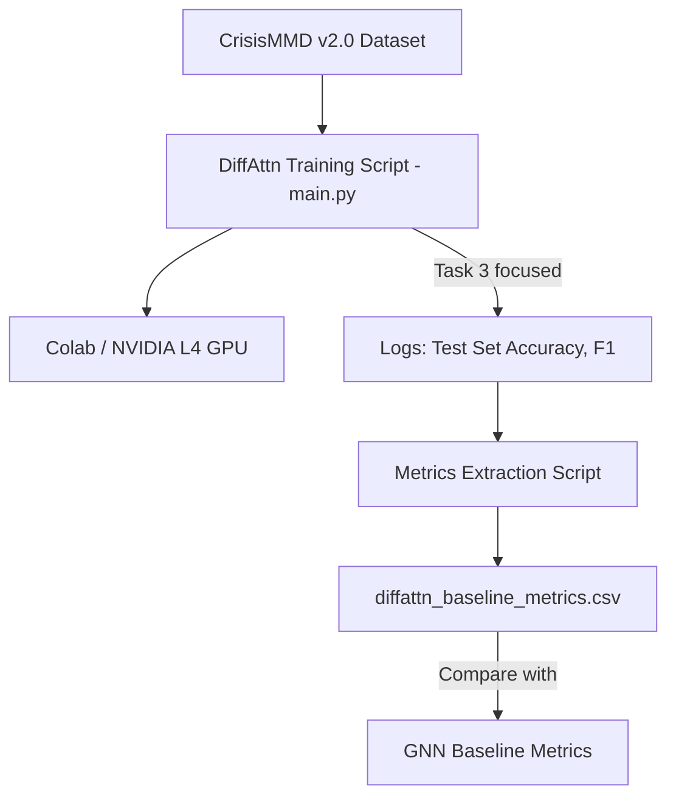

# Design: Differential Attention Baseline

## 1. Architecture Overview

## 2. Components
1. **DiffAttn Colab Notebook (`new_colab_notebook.ipynb`)**:
   - Được cập nhật cho môi trường Google Colab chuẩn (hỗ trợ Drive mount).
   - Tối ưu đoạn script chạy `main.py` để log stdout thành file `.txt` có cấu trúc rành mạch và tự động xuất ra một file summary metrics thống nhất `diffattn_results.csv`.
2. **Metrics Extraction (Output)**:
   - Thay vì chỉ in ra console (stdout), phần 4 ("Evaluation & Results") sẽ được modify / append một đoạn Python lưu dataFrame kết quả, có chứa: `[Task, Model, Accuracy, Micro F1, Macro F1, Weighted F1]`.

## 3. Data Models
Tạo một CSV file tên `baseline_metrics.csv` với các cột chuẩn:
- `timestamp`: (datetime)
- `experiment_name`: (ví dụ: DiffAttn_Baseline_Task3)
- `task`: (`informational`, `humanitarian`, `damage_severity`)
- `accuracy`: (float)
- `macro_f1`: (float)
- `weighted_f1`: (float)

## 4. Implementation Steps
- Cập nhật Cells ở Mục 4.1 trong Notebook (Extract Results from Logs) để tự động hóa write logs này ra Drive `drive/MyDrive/baseline_metrics.csv`.
- Đảm bảo Notebook sạch và không yêu cầu Human-in-the-loop đối với các bước clone, pip install, setup.
- Mọi module lỗi (LLaMA tokenizer, scheduler verbose) phải được automate fix từ Cell như đã có.

## 5. Security & Constraints
- Notebook tự động access Google Drive, do đó đường dẫn cần phải là biến toàn cục (`DRIVE_DATASET_PATH`) dễ thay đổi do máy Google Colab của User có cấu trúc thư mục khác nhau.
