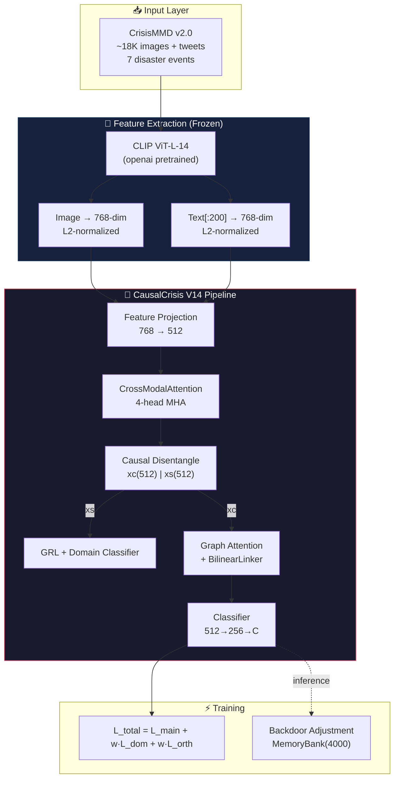

# 🔬 CausalCrisis — Phân Tích Sâu Kiến Trúc & Hệ Thống

> **Phạm vi:** Toàn bộ hệ thống CausalCrisis — từ Raw Data → Feature Extraction → Model Architecture → Training → Evaluation
> **Độ sâu:** Level 3 (Full dependency tracing)
> **Files analyzed:** ~3500+ dòng code across 15+ files

---

## 📐 Tổng Quan Kiến Trúc



---

## 📊 Thông Số Hệ Thống Chi Tiết

### Dataset — CrisisMMD v2.0

| Thông Số | Giá Trị |
|:---------|:--------|
| **Nguồn** | QCRI — `crisisnlp.qcri.org` |
| **Tổng ảnh** | ~18,000+ multimodal posts (tweets) |
| **Modalities** | Image (`.jpg`) + Text (tweet text) |
| **Sự kiện thảm họa** | 7: California Wildfires, Hurricane Harvey, Irma, Maria, Iraq-Iran EQ, Mexico EQ, Sri Lanka Floods |

#### Task Definitions

| Task | Tên | Loại | Số lớp | Mô tả |
|:-----|:----|:-----|:------:|:------|
| **Task 1** | Informative | Binary | 2 | Hữu ích cho cứu trợ? |
| **Task 2** | Humanitarian | Multi-class | 8→6 | Phân loại nhân đạo |
| **Task 3** | Damage Severity | Multi-class | 3 | Mức thiệt hại: Severe/Mild/None |

#### Class Merging Strategy (8→6 classes, Task 2)

| Nhãn gốc | → Nhãn mới | Index |
|:----------|:-----------|:-----:|
| affected_individuals | **affected_merged** | 0 |
| injured_or_dead_people | → **affected_merged** | 0 |
| missing_or_found_people | → **affected_merged** | 0 |
| infrastructure_and_utility_damage | giữ nguyên | 1 |
| not_humanitarian | giữ nguyên | 2 |
| other_relevant_information | giữ nguyên | 3 |
| rescue_volunteering_or_donation_effort | giữ nguyên | 4 |
| vehicle_damage | giữ nguyên | 5 |

---

### Model Architecture — V14 (Current Best)

````carousel
#### 🔌 Feature Projection Layer
```
img_feat (768-dim) → Linear(768, 512) → v (512-dim)
txt_feat (768-dim) → Linear(768, 512) → t (512-dim)
```

| Parameter | Value |
|:----------|:------|
| Input dim | 768 (raw CLIP) |
| Output dim | 512 |
| Activation | None (linear projection) |
<!-- slide -->
#### 🔗 CrossModalAttention
```
v(512), t(512) → MultiheadAttention(512, num_heads=4)
  Query = v, Key = t, Value = t → attended_v
  Query = t, Key = v, Value = v → attended_t
```

| Parameter | Value |
|:----------|:------|
| embed_dim | 512 |
| num_heads | 4 |
| head_dim | 128 |
| Output | fused(512) = LayerNorm(v + attended_v + t + attended_t) |
<!-- slide -->
#### 🧩 Causal Disentanglement
```python
# V14 inherits V2's shallow disentangler:
causal_head  = Sequential(Linear(512,512), ReLU)  → xc (512-dim)
spurious_head = Sequential(Linear(512,512), ReLU)  → xs (512-dim)
```

| Parameter | Value |
|:----------|:------|
| Input | fused (512) |
| Causal dim | 512 |
| Spurious dim | 512 |
| Depth | **1 layer** (shallow — bottleneck!) |
| Reconstruction | ❌ None |
<!-- slide -->
#### 📊 Graph Attention Layer (GAT)
```python
# V14-specific learnable attention:
attention_mlp = Linear(1024, 1)  # concat(h_i, h_j)

# Forward:
e_ij = LeakyReLU(attention_mlp(concat(h[i], h[j])))
α_ij = softmax(e_ij)  # over neighbors
h' = h + 0.3 * (α @ h)  # residual scale = 0.3
```

| Parameter | Value |
|:----------|:------|
| k (neighbors) | 4 |
| Normalization | Symmetric: D^(-½)AD^(-½) |
| Attention | `Linear(1024, 1)` with LeakyReLU |
| Residual Scale | 0.3 |
<!-- slide -->
#### 🔀 BilinearResidualLinker
```python
# V14-specific xc ⊕ xs fusion:
inter = (xc @ W_bilinear) * xs        # bilinear interaction
gate = sigmoid(Linear(concat(xc, inter)))  # gating
xc_linked = LayerNorm(xc + gate * proj(inter))  # residual
```

| Parameter | Value |
|:----------|:------|
| W_bilinear | (512, 512) learnable |
| Gate input | 1024 (concat xc + inter) |
| Projection | Linear(512, 512) |
<!-- slide -->
#### 🎯 Classifier Head
```python
classifier = Sequential(
    Linear(512, 256),
    ReLU(),
    Dropout(0.3),
    Linear(256, num_classes)  # 6 for V14
)
```

| Parameter | Value |
|:----------|:------|
| Hidden | 256 |
| Dropout | 0.3 |
| Output | 6 classes (merged) |
| Loss | CrossEntropy + LogitAdj(τ=0.9) + LabelSmooth(0.1) |
````

---

### Training Configuration

| Category | Parameter | Value |
|:---------|:----------|:------|
| **Optimization** | Optimizer | AdamW |
| | LR (backbone) | 5e-4 |
| | LR (GNN/Linker) | 1e-3 |
| | Weight Decay | 0.01 |
| | Scheduler | CosineAnnealingLR(T_max=50, η_min=1e-6) |
| **Training** | Batch Size | 32 (V14), 64 (V12) |
| | Total Epochs | 50 |
| | Early Stop Patience | 8 |
| | Seeds | [42, 123, 2026] |
| **GRL** | α schedule | `2/(1+exp(-10p)) - 1` |
| | max α | ~1.0 |
| **Loss Weights** | L_main | 1.0 |
| | L_domain (Phase 1) | 0.4 |
| | L_domain (Phase 2+) | 0.1 |
| | L_ortho (Phase 1) | 0.15 |
| | L_ortho (Phase 2+) | 0.05 |
| **Memory Bank** | Size | 4000 |
| | Dimension | 512 |
| | BA Sample (Inference) | 100 |
| | BA Sample (Training) | 50 |
| **Data** | Sampler | WeightedRandomSampler: `1/√(count + ε)` |
| | Class Weights | `1/(count^0.6 + 0.1)` normalized |
| | Label Smoothing | 0.1 |
| | Logit Adjustment τ | 0.9 |

---

### Curriculum Training Protocol

```mermaid
gantt
    title Training Phases (50 epochs)
    dateFormat X
    axisFormat %s
    
    section Phase 1
    Warm-up (no GNN/BA) : 0, 10
    
    section Phase 2
    Graph + Domain : 10, 50
    
    section Inference
    Backdoor Adjustment : milestone, 50, 0
```



| Phase | Epochs | Đặc điểm |
|:------|:------:|:---------|
| **Phase 1 (Warm-up)** | 1–10 | Chỉ train projection + disentangle, **KHÔNG** có GNN/BA |
| **Phase 2 (Full)** | 11–50 | Bật GNN, GRL, full loss, Memory Bank active |
| **Inference** | — | Backdoor Adjustment: Monte Carlo N=100 from MemoryBank |

---

## 📈 Kết Quả Hiện Tại vs SOTA

### Current Performance (V14, Task 2)

| Model | W-F1 (6-class) | W-F1 (5-class SOTA) | Accuracy |
|:------|:--------------:|:-------------------:|:--------:|
| **V14 (ours)** | 67.48% | 75.00% | 67.68% |
| **Diff-Attention** | — | **93.69%** | 93.92% |
| **Gap** | — | **-18.69 pp** | — |

### Per-Class Breakdown (V14, 6-class)

| Class | P | R | F1 | Support | 🔍 Issue |
|:------|:---:|:---:|:---:|:-------:|:---------|
| affected_merged | 0.56 | 0.61 | **0.58** | 143 | Merged heterogeneous |
| infra_damage | 0.53 | 0.39 | **0.45** | 164 | Low recall |
| not_humanitarian | 0.72 | 0.66 | 0.69 | 625 | Dominant class OK |
| other_relevant | 0.66 | 0.73 | 0.69 | 844 | Largest class OK |
| rescue_donation | 0.75 | 0.73 | **0.74** | 454 | Best minority! |
| vehicle_damage | 0.38 | 0.43 | **0.40** | 7 | ⚠️ Extreme minority |

---

## ⚠️ Bottlenecks & Risks

> [!WARNING]
> ### 1. Shallow Disentangler
> V14 chỉ dùng `Sequential(Linear, ReLU)` — 1 layer duy nhất, **không có reconstruction loss** để đảm bảo `concat(xc, xs) ≈ fused`. Causal/Spurious separation yếu.

> [!WARNING]
> ### 2. Dual System Conflict
> Notebook (V2→V14) và [src/models/causal_crisis_model.py](file:///c:/Users/Admin/OneDrive/Desktop/New%20folder/CrisisSummarization/src/models/causal_crisis_model.py) **không đồng bộ**: khác input dim (768 vs 256), khác architecture, khác feature format.

> [!CAUTION]
> ### 3. vehicle_damage = 7 mẫu
> Chỉ 7 mẫu test cho lớp này → **F1 = 0.40 không tin cậy thống kê**. Cần special handling hoặc exclude khỏi evaluation.

> [!IMPORTANT]
> ### 4. Graph Heterophily
> kNN graph trên raw features → ~40% edges nối đỉnh khác lớp. [EdgeHeterophilyScorer](file:///c:/Users/Admin/OneDrive/Desktop/New%20folder/CrisisSummarization/src/models/causalcrisis_v2.py#163-187) đã implement trong V2 nhưng **không được gọi** ở V14!

> [!NOTE]
> ### 5. No Multi-Task Learning (V14)
> V14 chỉ train Task 2 riêng lẻ. Modular system (`src/`) đã có MTL heads nhưng V14 notebook chưa integrate.

---

## 🗂️ File Reference Map

| File | Size | Lines | Role |
|:-----|:----:|:-----:|:-----|
| [causal_crisis_v2_training.ipynb](file:///c:/Users/Admin/OneDrive/Desktop/New%20folder/CrisisSummarization/causal_crisis_v2_training.ipynb) | 57KB | 1266 | **ENGINE CHÍNH** — full pipeline |
| [causal_crisis_model.py](file:///c:/Users/Admin/OneDrive/Desktop/New%20folder/CrisisSummarization/src/models/causal_crisis_model.py) | 46KB | 1148 | Model Master (modular) |
| [causalcrisis_v2.py](file:///c:/Users/Admin/OneDrive/Desktop/New%20folder/CrisisSummarization/src/models/causalcrisis_v2.py) | 11KB | 292 | Model V2 (simplified) |
| [causal_crisis_trainer.py](file:///c:/Users/Admin/OneDrive/Desktop/New%20folder/CrisisSummarization/src/trainers/causal_crisis_trainer.py) | 50KB | — | Trainer Master |
| [causalcrisis_v2_trainer.py](file:///c:/Users/Admin/OneDrive/Desktop/New%20folder/CrisisSummarization/src/trainers/causalcrisis_v2_trainer.py) | 24KB | — | V2 Trainer |
| [causal_gnn_v2_report.tex](file:///c:/Users/Admin/OneDrive/Desktop/New%20folder/CrisisSummarization/docs/ai/paper/causal_gnn_v2_report.tex) | 25KB | 294 | LaTeX report |
| [causal_q1_lodo.py](file:///c:/Users/Admin/OneDrive/Desktop/New%20folder/CrisisSummarization/causal_q1_lodo.py) | — | 735 | Q1 Model + LODO protocol |
