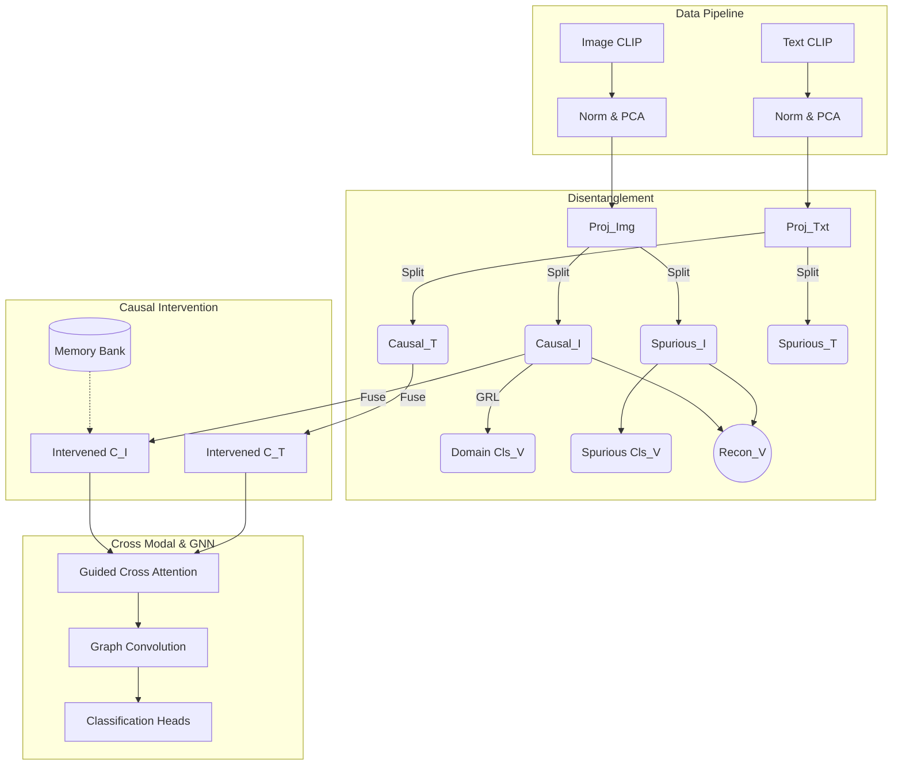

# Knowledge Capture: Causal Crisis Generalization Model

**Date**: 2026-03-08
**Files Touched**: `src/models/causal_crisis_model.py`, `src/trainers/causal_crisis_trainer.py`
**Depth**: Module Level & System Architecture

---

## 1. Overview
Hệ thống **Causal Crisis** là một framework GNN đa phương thức tích hợp kỹ thuật can thiệp nhân quả (Causal Intervention) và nghịch đảo gradient (Gradient Reversal Layer - GRL). Mục tiêu cốt lõi của module này là triệt tiêu các thông tin nhiễu (spurious correlations) biểu diễn đặc trưng riêng biệt của từng thảm họa và chỉ trích xuất các thông tin nền tảng về khủng hoảng có thể tổng quát hóa lên các thảm họa chưa từng thấy (Out-Of-Distribution Generalization).

---

## 2. Implementation Details

Module được chia thành 2 cấu phần chính:

### A. Causal Crisis Model
Gồm 6 Pipeline truyền dữ liệu chính (`forward` pass):
1. **Feature Projection**: Chuyển đổi đặc trưng đầu vào từ CLIP (đã qua PCA) thành không gian vector chuẩn ($d=512$).
2. **Causal Disentanglement**: Tach biệt đặc trưng nguyên bản thành `causal_feature` ($c$) và `spurious_feature` ($s$). Sử dụng `GradientReversalLayer` để đánh lừa bộ phân loại miền (domain classifier), ép buộc nơ-ron không chứa các thông tin cá biệt của sự kiện.
3. **Causal Intervention (do-calculus)**: Sử dụng một Memory Bank (lưu trữ các centroid của $c$) kết hợp trọng số `mix_ratio` để thay thế thông tin miền OOD, tạo ra $\hat{c}$ đã được chuẩn hóa.
    - *Lưu ý Validation*: Không sử dụng True Labels để update centroid lúc `eval()` nhằm tránh Data Leakage.
4. **Adaptive Diff Attention & Guided Cross Attention (GCA)**: Đánh trọng số chênh lệch giữa Image MMD và Text MMD, sau đó lai ghép chéo các không gian.
5. **Graph Propagation**: GNN chuyển thông điệp trên cấu trúc kNN (dùng `torch.sparse.mm` để chạy với Ma trận thưa, ngăn ngừa sập VRAM khi tính toán trên lượng Nodes khổng lồ).
6. **Classification & Multi-task Heads**: Đầu ra cho tác vụ nhân đạo, tác vụ thiệt hại, tác vụ mức độ nghiêm trọng.

### B. Causal Crisis Trainer
Môi trường huấn luyện giải quyết vòng lặp tối ưu hóa phức tạp nhất:
- **Phase-aware Weighting**: Huấn luyện tự động đổi trọng số (alpha) theo từng Phase vòng lặp (Khởi động GRL -> Mở trọng năng Causal -> Tinh chỉnh toàn diện).
- **Few-Shot Scalability**: Parameter được phân cụm (Group Decay) cho optimizer AdamW để không Decay layer *Bias* và *Norm*; hệ số $k$-neighbors động dãn theo số lượng N của Labeled Nodes.
- **Leave-One-Disaster-Out (LODO) Protocol**: Chức năng được thiết kế mới với `run_lodo_experiment` phục vụ chứng minh Out-of-Distribution, chia cắt dữ liệu theo cụm tự nhiên, và PCA an toàn chống Data Leakage.

---

## 3. Visual Diagrams (Architecture & Flow)

---

## 4. Dependencies
- `torch`, `torch.nn.functional`
- `sklearn.decomposition.PCA`, `sklearn.preprocessing.LabelEncoder`
- `faiss` (Tăng tốc tìm kiếm L2 thay thế tính toán toàn cụm ma trận).

---

## 5. Additional Insights (Những Bug Ngầm Đã Triệt Tiêu)
- **Semi-supervised Transductive Framework**: Unlabeled nodes (trong cùng Event hoặc LODO set) không tham gia tính Cross-Entropy Loss nhưng vẫn là điểm neo truyền Message trong vòng lặp GNN của `forward`. 
- **PCA phá vỡ L2 Norm**: Dữ liệu từ không gian hình cầu Unit Sphere (cosine similarity) sẽ bị hỏng sau PCA. Quy tắc fix: Re-norm `array = array / linalg.norm(array) + 1e-8`.
- **Focal Loss Extreme Scale**: Nếu áp lực lượng Nodes/Class không đồng đều ở tập Few-shot=50 ngẫu nhiên, Loss logit sẽ phát nổ dãn nở gradient. Quy tắc fix: Capped Class Weights trong phạm vi tối đa 5.0 và tối thiểu 0.5. Tùy chỉnh `gamma=1.0` cho Task 1 và `gamma=2.0` cho Task khác.
- **Tránh Gradient Conflict và Quá Tải Params**: Dùng chung (`shared weights`) Domain Classifier giữa các Modalities thay vì tách rời để giảm redundancy, đồng thời khởi tạo weights `Xavier Uniform` cùng `Zero Bias` thay vì default của Pytorch.
- **Backdoor Adjustment Decay**: Memory Bank (`counts`) được bổ sung EMA decay rate (`* 0.99`) để quên dần các mẫu cũ, tránh bị chi phối (dominate) bởi các Epoch luyện tập sơ thời.
- **Tối Ưu Phép Chiếu Trực Giao**: Chuyển từ Orthogonal Loss cấu trúc tuyến tính (Cosine Similarity) sang `HSIC (Hilbert-Schmidt Independence Criterion)` để phân tách Causal và Spurious Features hiệu quả hơn.
- **DiffAttn Vector Flipping**: Áp dụng `F.relu` triệt tiêu trọng số bị âm của phép trừ 2 phân bố Attention, ngăn các Vector Đặc Trưng bị đảo ngược phương hướng toán học.
- **Tính Toàn Vẹn Checkpoint & Môi trường**: Checkpoint đã bao gồm `Optimizer`/`Scheduler` states; Trainer tự động Fallback về `CPU` nếu hệ thống không có `CUDA` và tự xóa sạch features của các Image hỏng bị lỗi tải.

---

## 6. Next Steps
1. Khởi động Thí nghiệm `run_ablation_suite()` trên Colab V100/A100 để vẽ bảng phân tích ảnh hưởng từng Cấu phần (Attention, Causal, Disentanglement).
2. Vẽ biểu đồ Phân tán (T-SNE) cho Disentanglement Features để chứng minh không gian đặc trưng Causal Event-Agnostic.
